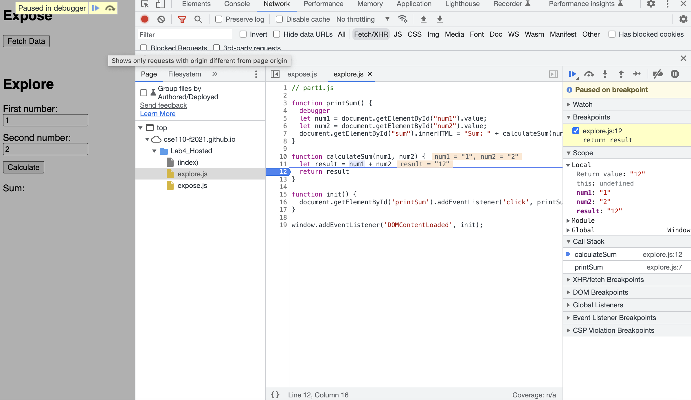
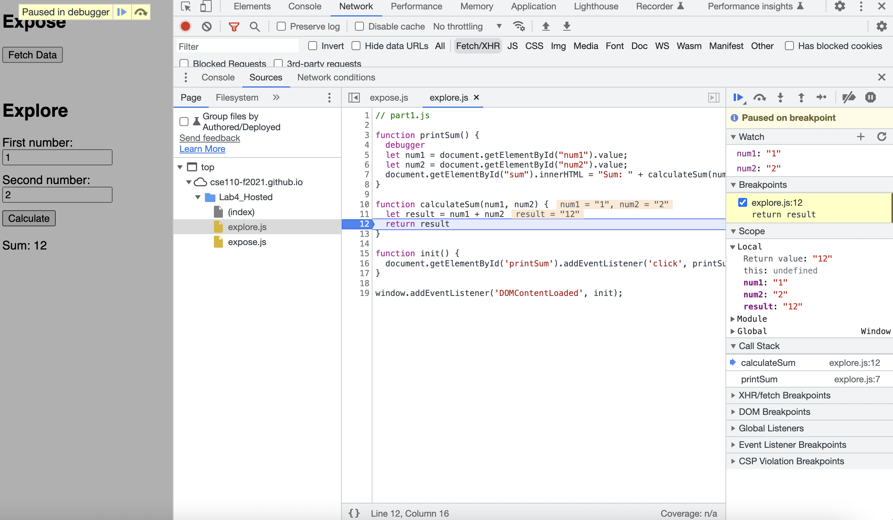
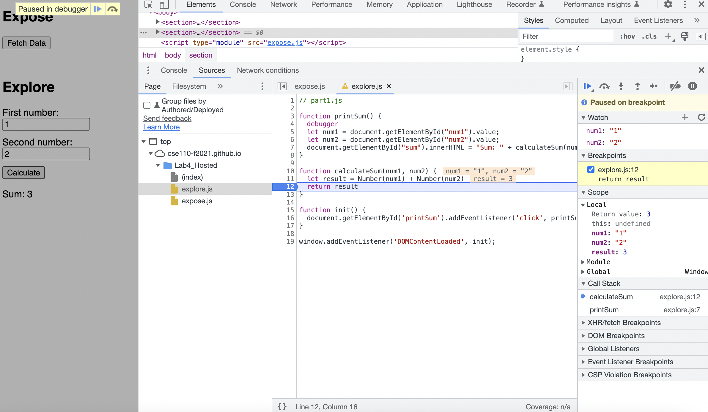

1. The bug was variable num1 and num2 were read input as string, and the result of sum was a string that consist of num1 and num2.

2. I add Number() to convert num1 and num2 to number when calculate the sum.

    